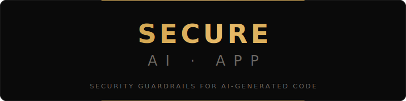

<div align="center">

<picture>
  <source media="(prefers-color-scheme: dark)" srcset="docs/assets/banner.svg">
  <source media="(prefers-color-scheme: light)" srcset="docs/assets/banner.svg">
  
</picture>

<br/><br/>

[](LICENSE)
[](https://www.npmjs.com/package/@secure-ai-app/cli)
[](https://www.npmjs.com/package/@secure-ai-app/cli)
[](#no-llm-in-the-loop)

</div>

---

> **The first time I ran this on my own codebase, it found a live Google Play RSA private key hardcoded in a file.
> My own codebase. First run. That's not a demo — that's the point.**

---

## Built for vibe coders

If you built your app with **Cursor, Lovable, Replit, or Claude** — run this before you ship.

AI writes code fast. It also confidently writes code with hardcoded secrets, exposed credentials, missing auth guards, and unscoped API calls. Not because it's broken — because it was never asked to check.

`secure-ai-app` is the check.

```sh
npx @secure-ai-app/cli scan
```

**No account. No platform. No GitHub OAuth. No signup. Just results.**

Runs in milliseconds. Works offline. Gates your CI. Understands your stack.

### No LLM in the loop

This is deterministic — regex, AST analysis, file system checks. Same input, same results, every time. No model, no API key, no inference cost.

Why? Because LLMs optimize for *completion*, not safety. They'll confidently generate code that runs, passes type checks, and leaks your API keys to the client bundle. They're solving for "does it work" — not "should it ship." The same fluency that makes them fast makes them dangerous when nobody's checking.

`secure-ai-app` doesn't reason about your code. It *inspects* it. That's the difference between a tool that might catch something and one that always will.

---

## See it in action


---

## Install

```sh
npm install -g @secure-ai-app/cli
```

Or run without installing:

```sh
npx @secure-ai-app/cli scan
```

---

## Quick start

```sh
# Initialize config + install pre-commit hook
secure-ai-app init

# Scan your project (82ms for 78 files)
secure-ai-app scan

# Auto-fix what's fixable
secure-ai-app fix

# Check your score
secure-ai-app status
```

---

## What it catches

<table>
<tr>
<td width="50%" valign="top">

### 🔑 Secrets & Keys

- Hardcoded API keys (OpenAI, AWS, generic)
- `NEXT_PUBLIC_` prefix on sensitive env vars
- `.env` files not in `.gitignore`
- Credentials logged to console

</td>
<td width="50%" valign="top">

### 🔐 Auth & Access

- Route components missing auth guards
- API calls missing user/tenant scoping
- AI agents with unrestricted tool access
- Credentials stored in `localStorage` or `sessionStorage`

</td>
</tr>
</table>

---

## Rules

10 rules across 4 categories. 7 are universal — 3 provide deep SDK-aware analysis for [Flowstack](https://github.com/KeonCummings/flowstack-sdk) projects and are automatically skipped in projects that don't use the SDK.

| Rule | Severity | Engine |
|------|----------|--------|
| `secrets/hardcoded-api-key` | 🔴 Critical | Regex |
| `secrets/env-exposure` | 🟠 High | Regex |
| `secrets/dotenv-security` | 🟠 High | File check |
| `general/unsafe-eval` | 🟠 High | Regex |
| `general/console-credentials` | 🟡 Medium | Regex |
| `auth/missing-auth-guard` | 🟠 High | AST |
| `tenant/missing-tenant-scope` | 🟡 Medium | AST |
| `tenant/missing-user-scope` | 🟠 High | AST |
| `ai/secret-in-prompt` | 🔴 Critical | AST |
| `ai/unrestricted-tools` | 🟡 Medium | AST |

---

## Scoring

Starts at 100. Deducts per finding.

| Severity | Deduction | Grade |
|----------|-----------|-------|
| Critical | −20 | **A** 90+ |
| High | −10 | **B** 75+ |
| Medium | −5 | **C** 60+ |
| Low | −2 | **D** 40+ · **F** <40 |

---

## Commands

### `scan`

```sh
secure-ai-app scan [options]
```

| Flag | Description |
|------|-------------|
| `-p, --path <path>` | Project root (default: `.`) |
| `-f, --format <format>` | Output: `table`, `json`, `sarif` |
| `-s, --severity <level>` | Minimum: `critical`, `high`, `medium`, `low` |
| `--changed-only` | Only scan files changed since last commit |

### `fix`

```sh
secure-ai-app fix [options]
```

Auto-applies fixes for rules that have safe, deterministic resolutions. Unsafe fixes require manual review and are flagged, never auto-applied.

### `init`

```sh
secure-ai-app init
```

Creates `.secure-ai-app.json` config and installs a pre-commit hook that blocks commits with critical findings.

### `hooks`

```sh
secure-ai-app hooks install   # Add pre-commit hook
secure-ai-app hooks remove    # Remove pre-commit hook
```

---

## CI/CD integration

### GitHub Actions

```yaml
- name: Security scan
  run: npx @secure-ai-app/cli scan --format sarif --severity high
```

### Block on critical findings

```sh
secure-ai-app scan --severity critical && echo "✓ Clean" || exit 1
```

---

## Configuration

```json
{
  "exclude": ["**/node_modules/**", "**/dist/**", "**/Pods/**"],
  "rules": {
    "general/console-credentials": "warn",
    "ai/unrestricted-tools": "off"
  },
  "severity": "medium"
}
```

---

## Programmatic API

```ts
import { ScanEngine, FixEngine } from '@secure-ai-app/cli';

const engine = new ScanEngine();
const report = await engine.scan({ path: '.', severity: 'high' });

console.log(report.score);     // { value: 93, grade: 'A', ... }
console.log(report.findings);  // Finding[]

const fixer = new FixEngine();
const results = fixer.applyAll(fixer.getFixableFindings(report.findings), '.');
```

---

## Part of Flowstack

`secure-ai-app` is the security layer of the [Flowstack](https://github.com/KeonCummings/flowstack-sdk) SDK.

Flowstack provides production-grade primitives for AI-native apps — auth, multi-tenancy, agent connectivity — all as React hooks. `secure-ai-app` knows every hook, every API pattern, every failure mode, because we built both sides.

That's what makes the auth guard detection, tenant scoping rules, and agent tool analysis work at the semantic level — not just pattern matching.

**Flowstack users get deeper analysis automatically. Non-Flowstack projects get everything else.**

---

## Why not Semgrep?

Semgrep is a rule engine. A powerful one. But its default quickstart is:

1. Go to the AppSec Platform
2. Sign up with GitHub
3. Create an organization
4. Then scan

`secure-ai-app` is:

```sh
npx @secure-ai-app/cli scan
```

No account. No org. No OAuth. No platform dependency. Works before you've committed anything. Works in CI without a token. Works on a weekend side project that doesn't have a GitHub org yet.

---

## Contributing

Found a pattern `secure-ai-app` misses? [Open an issue](https://github.com/KeonCummings/secure-ai-app/issues) with the code sample. That's how the rule library grows — real codebases, real findings.

Known false positive? [Flag it](https://github.com/KeonCummings/secure-ai-app/issues). We'd rather tune the rules than generate noise.

---

## License

MIT — use it, fork it, build on it.

---

<div align="center">

Built by [Keon Cummings](https://keoncummings.com) · [Not In The SOW](https://keoncummings.com/newsletter) newsletter

*The work nobody scoped.*

</div>
