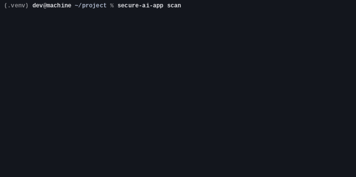
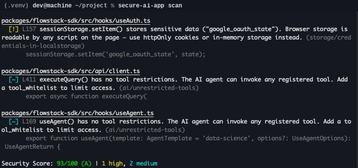

<div align="center">

# secure-ai-app

**Security guardrails for AI-generated code.**

Built for teams shipping fast with AI — where the code works but the security review didn't happen.

[](LICENSE)
[](https://www.npmjs.com/package/@secure-ai-app/cli)

</div>

---

<p align="center">
  
</p>

<p align="center">
  
</p>

---

Scans your codebase for hardcoded secrets, missing auth guards, tenant isolation gaps, unsafe eval, and AI-specific risks like secrets leaking into prompts. Auto-fixes what it can. Blocks commits that fail.

**10 rules. Zero config. One command.**

```bash
npx secure-ai-app scan
```

## Install

```bash
npm install -g @secure-ai-app/cli
```

## Quick Start

```bash
# Initialize config + install pre-commit hook
secure-ai-app init

# Scan your project
secure-ai-app scan

# Auto-fix what's fixable
secure-ai-app fix

# Check your score
secure-ai-app status
```

## What it catches

<table>
<tr>
<td width="50%">

### Secrets & Keys
- Hardcoded API keys (OpenAI, AWS, generic)
- `NEXT_PUBLIC_` prefix on sensitive env vars
- `.env` files not in `.gitignore`

### AI-Specific
- Secrets interpolated into AI prompts
- Agent calls without tool whitelists

</td>
<td width="50%">

### Auth & Access
- Route components missing auth guards
- API calls missing user/tenant scoping

### Code Safety
- `eval()` and `new Function()` calls
- `console.log()` leaking credentials

</td>
</tr>
</table>

## Rules

| ID | Severity | Fixable | What it catches |
|----|----------|---------|-----------------|
| `secrets/hardcoded-api-key` | critical | yes | OpenAI, AWS, Flowstack, and generic API keys/tokens in source |
| `secrets/env-exposure` | high | — | `NEXT_PUBLIC_` prefix on secrets, passwords, JWTs |
| `secrets/dotenv-security` | high | yes | `.env` files not listed in `.gitignore` |
| `general/unsafe-eval` | high | — | `eval()` and `new Function()` calls |
| `general/console-credentials` | medium | — | `console.log()` calls exposing passwords, tokens, or keys |
| `auth/missing-auth-guard` | high | yes | Next.js route components without `AuthGuard` or `useAuthGuard()` |
| `tenant/missing-tenant-scope` | medium | yes | API calls missing `X-Tenant-ID` header |
| `tenant/missing-user-scope` | high | yes | API calls missing `X-User-ID` header |
| `ai/secret-in-prompt` | critical | — | Environment variables interpolated into AI prompt strings |
| `ai/unrestricted-tools` | medium | — | AI agent calls without a tool whitelist |

Seven rules are universal. Three provide deep SDK-aware analysis for [Flowstack](https://flowstack.fun) projects — auth guards, tenant scoping, user scoping — and are automatically skipped in projects that don't use the SDK.

## Scoring

Security score starts at 100 and deducts per finding:

| Severity | Deduction | Grade |
|----------|-----------|-------|
| Critical | -20 | **A** 90+ |
| High | -10 | **B** 75+ |
| Medium | -5 | **C** 60+ |
| Low | -2 | **D** 40+ / **F** <40 |

## Commands

### `scan`

```bash
secure-ai-app scan [options]
```

| Flag | Description |
|------|-------------|
| `-p, --path <path>` | Project root (default: `.`) |
| `-f, --format <format>` | Output: `table`, `json`, `sarif` |
| `-s, --severity <level>` | Minimum: `critical`, `high`, `medium`, `low` |
| `--changed-only` | Only scan files changed since last commit |
| `-r, --rule <rules...>` | Only run specific rule IDs |

Exits with code 1 if critical or high findings exist — built for CI.

```bash
# Only critical issues, as JSON
secure-ai-app scan --severity critical --format json

# Fast pre-commit check
secure-ai-app scan --changed-only

# SARIF for GitHub Code Scanning
secure-ai-app scan --format sarif > results.sarif
```

### `fix`

```bash
secure-ai-app fix [options]
```

| Flag | Description |
|------|-------------|
| `--dry-run` | Preview without applying |
| `-i, --interactive` | Prompt before each fix |
| `--backup` | Create `.bak` files first |
| `-r, --rule <rules...>` | Fix specific rules only |

### `status`

One-line security score.

### `init`

Creates `.secure-ai-app.json` config and installs the pre-commit hook.

### `hooks install` / `hooks remove`

Manage the pre-commit hook independently.

## CI Integration

### GitHub Actions

```yaml
- name: Security scan
  run: npx secure-ai-app scan --format sarif > results.sarif

- name: Upload SARIF
  uses: github/codeql-action/upload-sarif@v3
  with:
    sarif_file: results.sarif
```

### Pre-commit Hook

Installed automatically by `secure-ai-app init`. Runs on changed files only:

```bash
npx secure-ai-app scan --changed-only --severity high
```

Blocks commits with critical or high findings.

## Configuration

`secure-ai-app init` creates `.secure-ai-app.json`:

```json
{
  "severity": "medium",
  "format": "table",
  "exclude": ["node_modules", "dist", ".next", "build", "coverage"],
  "hooks": { "preCommit": true }
}
```

Disable a rule:

```json
{
  "rules": {
    "general/console-credentials": "off"
  }
}
```

## Programmatic API

```ts
import { ScanEngine, FixEngine } from '@secure-ai-app/cli';

const engine = new ScanEngine();
const report = await engine.scan({ path: '.', severity: 'high' });

console.log(report.score);     // { value: 75, grade: 'B', ... }
console.log(report.findings);  // Finding[]

const fixer = new FixEngine();
const results = fixer.applyAll(fixer.getFixableFindings(report.findings), '.');
```

## Part of Flowstack

secure-ai-app is the security layer of the [Flowstack](https://flowstack.fun) SDK. It knows every hook, every API pattern, every failure mode — because we built both sides.

It found a real Google Play private key hardcoded in our own repo on first run. That's not a demo. That's the point.

## License

MIT
